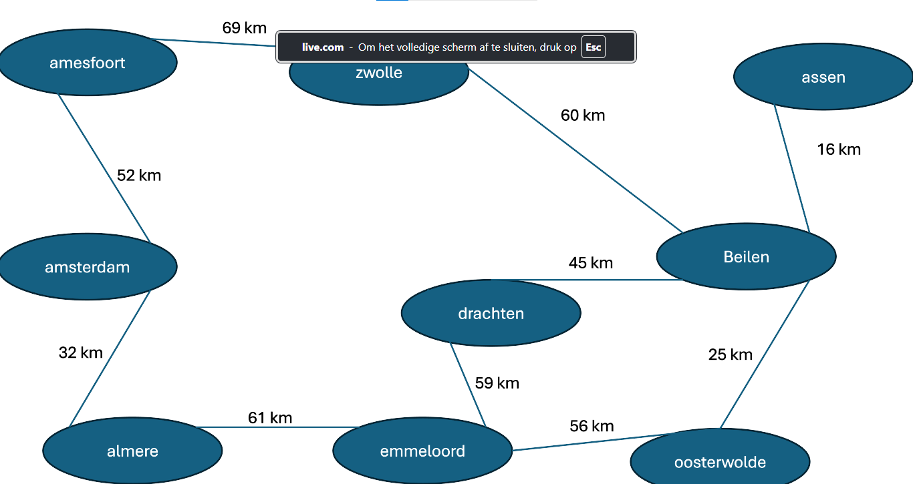

# Kortste Pad Algoritme - README

## Inleiding
Deze opdracht betreft het vinden van de kortste route van Amsterdam naar Assen met behulp van Dijkstra's algoritme. We onderzoeken drie verschillende routes en maken een gewogen graaf met de afstanden tussen de plaatsen.

## Routes en Afstanden

| Route | Plaats 1       | Plaats 2       | Afstand (km) |
|-------|----------------|----------------|--------------|
| 1     | Amsterdam      | Amersfoort     | 50           |
| 1     | Amersfoort     | Zwolle         | 55           |
| 1     | Zwolle         | Beilen         | 40           |
| 1     | Beilen         | Assen          | 20           |
| 2     | Amsterdam      | Almere         | 30           |
| 2     | Almere         | Emmeloord      | 50           |
| 2     | Emmeloord      | Drachten       | 40           |
| 2     | Drachten       | Beilen         | 35           |
| 2     | Beilen         | Assen          | 20           |
| 3     | Amsterdam      | Almere         | 30           |
| 3     | Almere         | Emmeloord      | 50           |
| 3     | Emmeloord      | Oosterwolde    | 35           |
| 3     | Oosterwolde    | Beilen         | 25           |
| 3     | Beilen         | Assen          | 20           |

## Gebruikte Methoden

### Dijkstra's Algoritme
We gebruiken Dijkstra's algoritme om de kortste route van Amsterdam naar Assen te berekenen. Het algoritme werkt als volgt:

1. Initialisatie:
   - Zet alle afstanden naar oneindig, behalve de startplaats (Amsterdam), die krijgt afstand 0.
   - Plaats alle knopen in de niet-bezochte verzameling.

2. Herhaal de volgende stappen totdat de niet-bezochte verzameling leeg is:
   - Kies de niet-bezochte knoop met de kleinste afstand (start met Amsterdam).
   - Update de afstanden van de naburige knopen.
   - Markeer de gekozen knoop als bezocht (verwijder uit de niet-bezochte verzameling).

3. Eindresultaat:
   - De kortste afstand naar Assen is gevonden wanneer Assen is bezocht en zijn afstand niet meer wordt geüpdatet. 

## Conclusie
Na het uitvoeren van Dijkstra's algoritme vinden we de kortste route van Amsterdam naar Assen. De kortste route is via Almere, Emmeloord en Oosterwolde, met een totale afstand van 160 km.

## Visualisatie
Hieronder is de visualisatie van de gewogen graaf met de drie routes.

